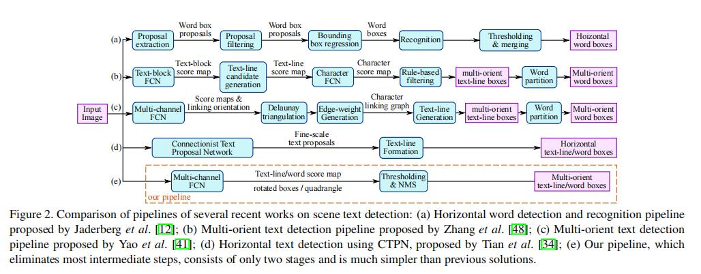
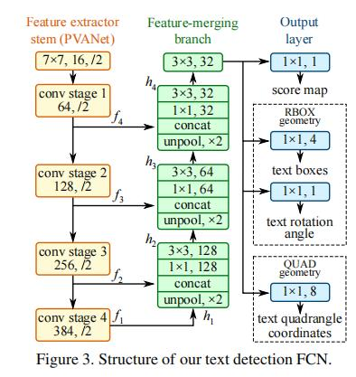

# EAST: An Efficient and Accurate Scene Text Detector

当时（2017年）文字检测的技术路线：

## 提出的优势

- 提出了基于two-stage的文本检测方法：全卷机网络（FCN）和非极大值抑制，消除中间过程冗余，减少检测时间。
- 该方法既可以检测单词级别，又可以检测文本行级别。检测的形状可以为任意形状的四边形：即可以是旋转矩形，也可以是普通四边形。
- 采用`Locality-Aware NMS`对生成的几何进行过滤。
- 速度与精度上有一定的提升

## 方法思路

## 损失函数

loss由两部分组成：`score map loss`和`geometry loss`：$$L_{loss} = L_{s}+\lambda_gL_gL_{loss} = L_s+\lambda_gL_g$$

- 分数图损失函数

论文中采用的是类平衡交叉熵，用于解决类别不平衡训练，避免通过 平衡采样和硬负挖掘 解决目标物体的不不平衡分布，简化训练过程。但是在具体实战中，一般采用dice loss，它的收敛速度会比类平衡交叉熵快。

- 几何形状损失

文本在自然场景中的尺寸变化极大。直接使用`L1`或者`L2`损失去回归文本区域将导致损失偏差朝更大更长．因此论文中采用IoU损失在RBOX回归的AABB部分，尺度归一化的`smoothed-L1`损失在`QUAD`回归，来保证几何形状的回归损失是尺度不变的。

## 局部感知NMS(locality-aware NMS)

与通用目标检测相似，阈值化后的结果需要经过非极大值抑制(NMS)来得到最终的结果．由于本文中面临的是成千上万个几何体，如果用普通的NMS，其计算复杂度是O(n^2)O(n2)，n是几何体的个数，这是不可接受的．

针对上述时间复杂度问题，本文提出了基于行合并几何体的方法，当然这是基于邻近几个几何体是高度相关的假设．注意：这里合并的四边形坐标是通过两个给定四边形的得分进行加权平均的，也就是说这里是"平均"而不是"选择"几何体。

## 参考
1. [EAST: An Efficient and Accurate Scene Text Detector](https://arxiv.org/pdf/1704.03155.pdf)