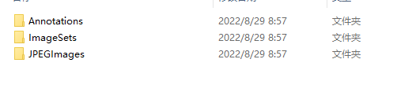
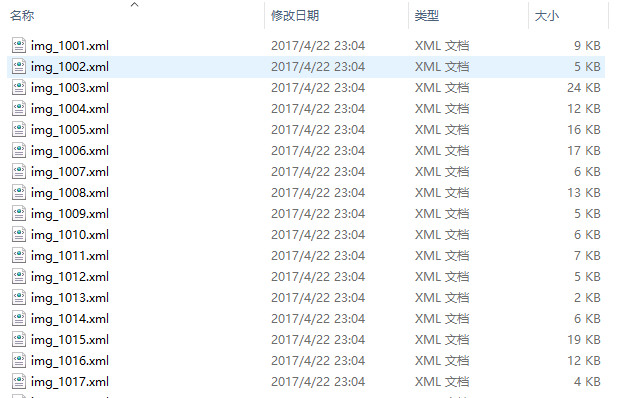
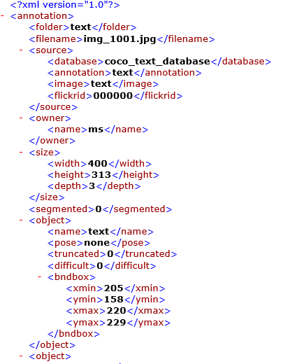
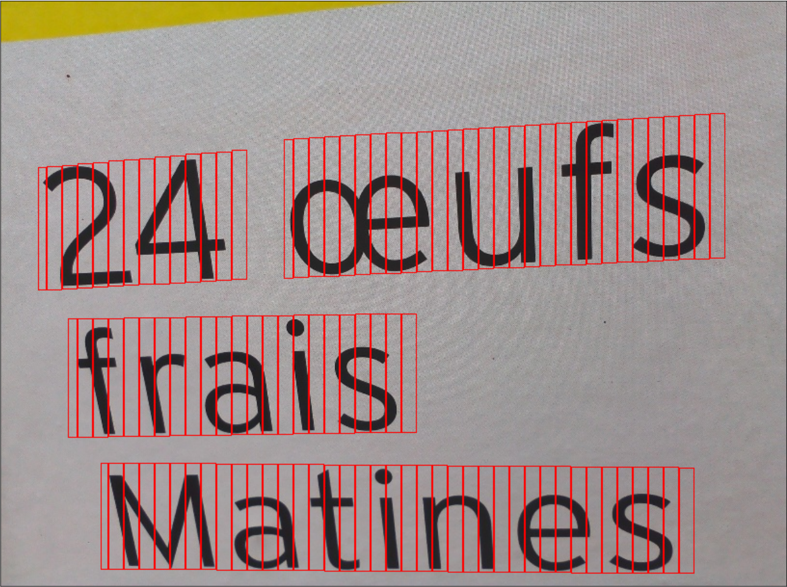
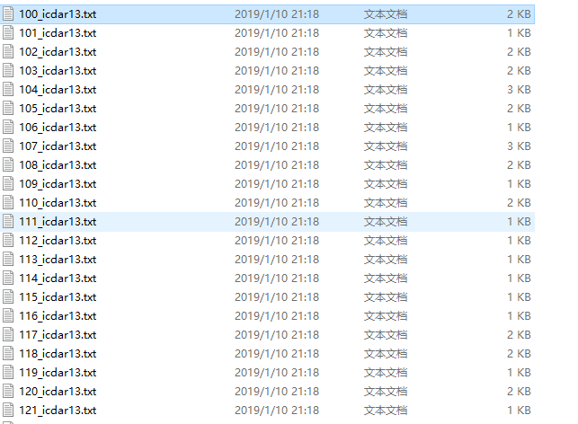
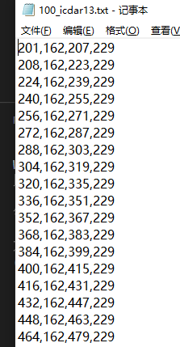
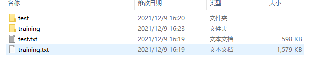
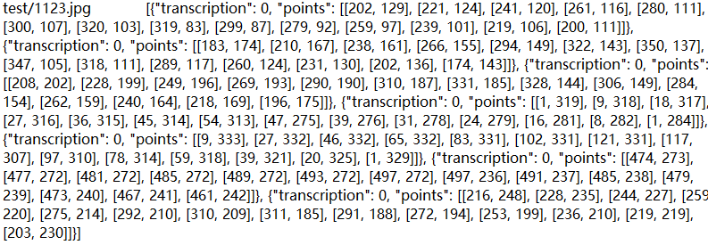

# OCR数据集

本文档介绍OCR数据集。

## 文字检测

### VOC格式的数据集

在本仓库实现的CTPN代码中，训练集文件架构如下图所示，是标准的VOC格式的数据。




训练集的标注文件以`xml`格式保存，如下图所示：


 

`xml`文件中的信息是已经经过分割box的标记：



可视化的结果如下：



### mlt数据集

mlt数据集其实跟VOC数据集相似，都是保存分割后的box的坐标。该数据集下包含两个文件夹：`image`和`label`。`image`保存的是图像数据，`label`保存的是标签数据。其中`label`数据如下图所示：







### paddleOCR 文字检测

PaddleOCR 中的文本检测算法支持的标注文件格式如下，中间用"\t"分隔：

```
" 图像文件名                    json.dumps编码的图像标注信息"
ch4_test_images/img_61.jpg    [{"transcription": "MASA", "points": [[310, 104], [416, 141], [418, 216], [312, 179]]}, {...}]
```





### 其他数据集

1. [ICDAR 2015](https://rrc.cvc.uab.es/?ch=4&com=downloads)

2. [total text](https://paddleocr.bj.bcebos.com/dataset/total_text.tar)


## 文字识别数据集

1. [ICDAR2019-LSVT](https://ai.baidu.com/broad/introduction?dataset=lsvt)：共45w中文街景图像，包含5w（2w测试+3w训练）全标注数据（文本坐标+文本内容），40w弱标注数据（仅文本内容）。

2. [ICDAR2017-RCTW-17](https://rctw.vlrlab.net/)：共包含12,000+图像，大部分图片是通过手机摄像头在野外采集的。有些是截图。这些图片展示了各种各样的场景，包括街景、海报、菜单、室内场景和手机应用程序的截图。

3. [中文街景文字识别](https://aistudio.baidu.com/aistudio/competition/detail/8)：ICDAR2019-LSVT行识别任务，共包括29万张图片，其中21万张图片作为训练集（带标注），8万张作为测试集（无标注）。数据集采自中国街景，并由街景图片中的文字行区域（例如店铺标牌、地标等等）截取出来而形成。所有图像都经过一些预处理，将文字区域利用仿射变化，等比映射为一张高为48像素的图片。

4. [中文文档文字识别](https://github.com/YCG09/chinese_ocr)：共约364万张图片，按照99:1划分成训练集和验证集。数据利用中文语料库（新闻 + 文言文），通过字体、大小、灰度、模糊、透视、拉伸等变化随机生成包含汉字、英文字母、数字和标点共5990个字符（字符集合：https://github.com/YCG09/chinese_ocr/blob/master/train/char_std_5990.txt ）。每个样本固定10个字符，字符随机截取自语料库中的句子。图片分辨率统一为280x32


## 手写OCR数据集

1. [中科院自动化研究所-手写中文数据集](https://github.com/PaddlePaddle/PaddleOCR/blob/release/2.6/doc/doc_ch/dataset/handwritten_datasets.md)：包含在线和离线两类手写数据，HWDB1.0~1.2总共有3895135个手写单字样本，分属7356类（7185个汉字和171个英文字母、数字、符号）；HWDB2.0~2.2总共有5091页图像，分割为52230个文本行和1349414个文字。所有文字和文本样本均存为灰度图像。

2. [NIST手写单字数据集-英文](https://www.nist.gov/srd/nist-special-database-19)：NIST19数据集适用于手写文档和字符识别的模型训练，从3600位作者的手写样本表格中提取得到，总共包含81万张字符图片。


## 版面分析数据集

1. [publaynet数据集](https://github.com/ibm-aur-nlp/PubLayNet)：publaynet数据集的训练集合中包含35万张图像，验证集合中包含1.1万张图像。总共包含5个类别，分别是：`text`, `title`, `list`, `table`, `figure`。

2. [CDLA数据集](https://github.com/buptlihang/CDLA)：CDLA据集的训练集合中包含5000张图像，验证集合中包含1000张图像。总共包含10个类别，分别是：`Text`, `Title`, `Figure`, `Figure caption`, `Table`, `Table caption`, `Header`, `Footer`, `Reference`, `Equation`。

3. [TableBank数据集](https://doc-analysis.github.io/tablebank-page/index.html)


## 表格识别数据集

1. [PubTabNet](https://github.com/ibm-aur-nlp/PubTabNet)

2. [WTW中文场景表格数据集](https://github.com/wangwen-whu/WTW-Dataset)


## 垂类多语言OCR数据集

1. [中国城市车牌数据集](https://github.com/detectRecog/CCPD)

2. [银行信用卡数据集](https://www.kesci.com/home/dataset/5954cf1372ead054a5e25870)

3. [验证码数据集-Captcha](https://github.com/lepture/captcha)

4. [多语言数据集(Multi-lingual scene text detection and recognition)](https://rrc.cvc.uab.es/?ch=15&com=downloads)


## 关键数据抽取数据集

1. [FUNSD数据集](https://guillaumejaume.github.io/FUNSD/)：FUNSD数据集是一个用于表单理解的数据集，它包含199张真实的、完全标注的扫描版图片，类型包括市场报告、广告以及学术报告等，并分为149张训练集以及50张测试集。FUNSD数据集适用于多种类型的DocVQA任务，如字段级实体分类、字段级实体连接等。

2. [XFUND数据集](https://github.com/doc-analysis/XFUND)：XFUND是一个多语种表单理解数据集，它包含7种不同语种的表单数据，并且全部用人工进行了键-值对形式的标注。其中每个语种的数据都包含了199张表单数据，并分为149张训练集以及50张测试集。

3. [wildreceipt数据集](https://arxiv.org/abs/2103.14470)：wildreceipt数据集是英文发票数据集，包含26个类别（此处类别体系包含Ignore类别），共标注了50000个文本框。其中训练集包含1267张图片，测试集包含472张图片。

## 参考

1. [mlt数据集](https://github.com/eragonruan/text-detection-ctpn)

2. [VOC数据集](https://github.com/YCG09/chinese_ocr/tree/master/ctpn、https://github.com/xiaofengShi/CHINESE-OCR/tree/master/ctpn/ctpn)

3. [OCR数据介绍](https://github.com/PaddlePaddle/PaddleOCR/blob/release/2.5/doc/doc_ch/dataset/ocr_datasets.md)